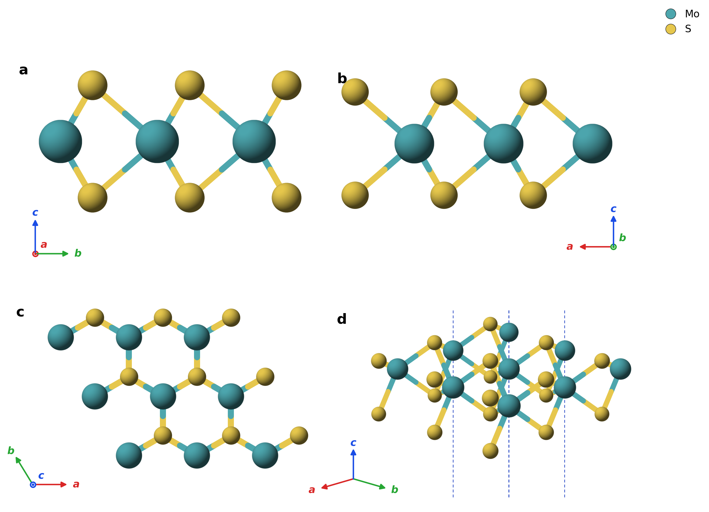
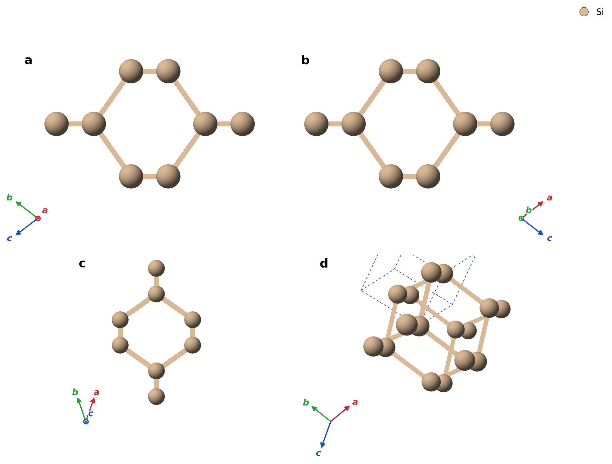
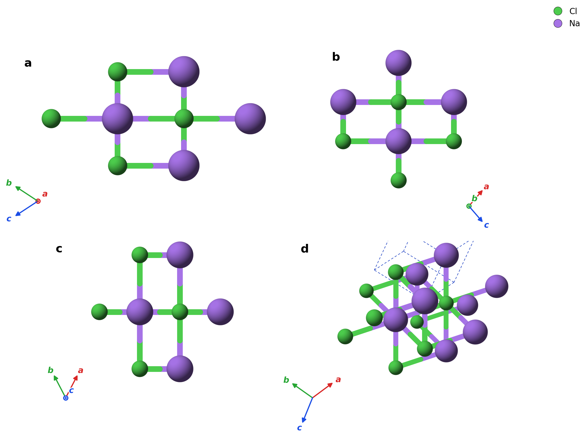

A simple Claude Code agent skill for crystal structure plotting. A reasonable starting point for further tuning.

## How to use

Ask the agent to install <https://github.com/sogang-qmp/skills-crystal-plot>, then ask it in natural language. The skill triggers on phrases like *plot the structure of MoS2 monolayer*, *render this POSCAR*, *VESTA-like figure of bulk Si*, or Korean equivalents (결정구조 플롯, 원자구조 그려). Pass either a structure file (`.cif`, `POSCAR`, `.vasp`, `.xyz`, `.traj`) or a preset such as `mx2:MoS2`, `bulk:Si`, `graphene`. The agent runs the renderer and returns a PNG.

Defaults (perspective angle, bond cutoff, color palette, depth scaling) are set to reasonable values. For fine tuning just tell the agent in natural language, e.g. *use a steeper tilt, no cell box, repeat 4×4×1*.

## Example outputs

## Repo

[sogang-qmp/skills-crystal-plot](https://github.com/sogang-qmp/skills-crystal-plot)
